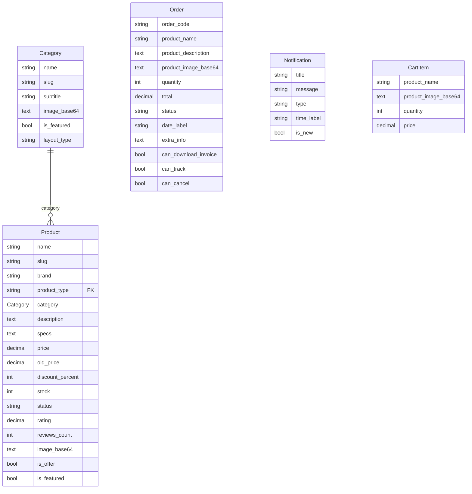
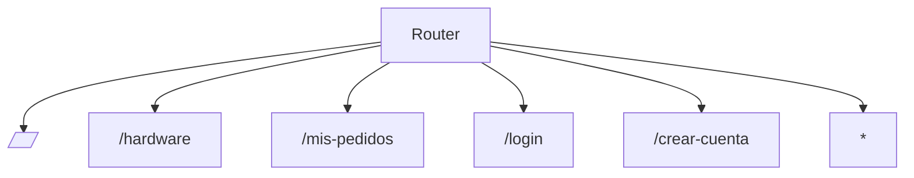
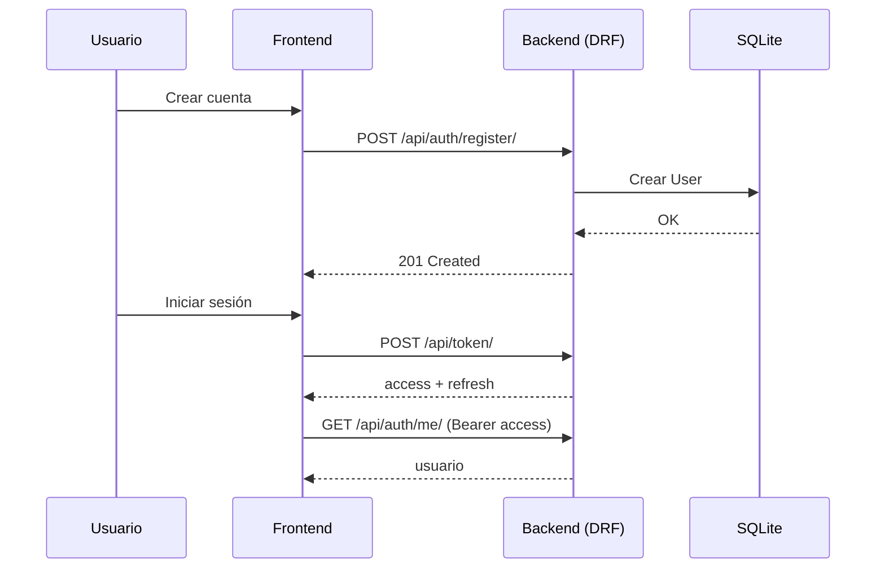
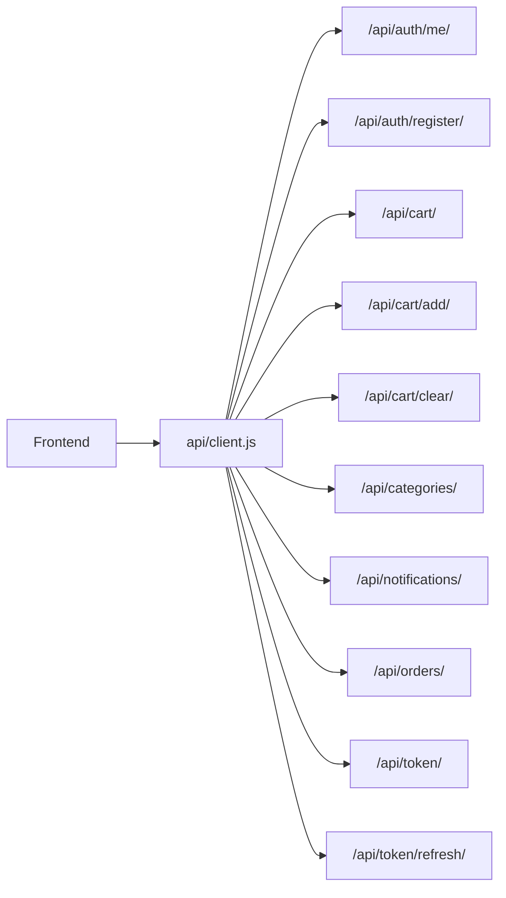

# Diagramas (Mermaid) - Palacio Gamer

Este archivo se genera automáticamente.

## ERD (SQLite / Django Models)


## Arquitectura (Frontend → Backend → DB)
```mermaid
flowchart LR
  FE[Frontend (Vite/React)] -->|/api/* proxy| BE[Backend (Django/DRF)]
  BE --> DB[(SQLite)]
  subgraph API[API Endpoints]
    api["/api/"]
    api_token["/api/token/"]
    api_token_refresh["/api/token/refresh/"]
    api_auth_me["/api/auth/me/"]
    api_auth_register["/api/auth/register/"]
    api_cart["/api/cart/"]
    api_cart_add["/api/cart/add/"]
    api_cart_clear["/api/cart/clear/"]
    api_categories["/api/categories/"]
    api_notifications["/api/notifications/"]
    api_orders["/api/orders/"]
    api_products["/api/products/"]
  end
```

## Rutas (React Router)


## Auth (Registro + JWT + Me)


## Consumo de API (frontend/src/api/client.js)

