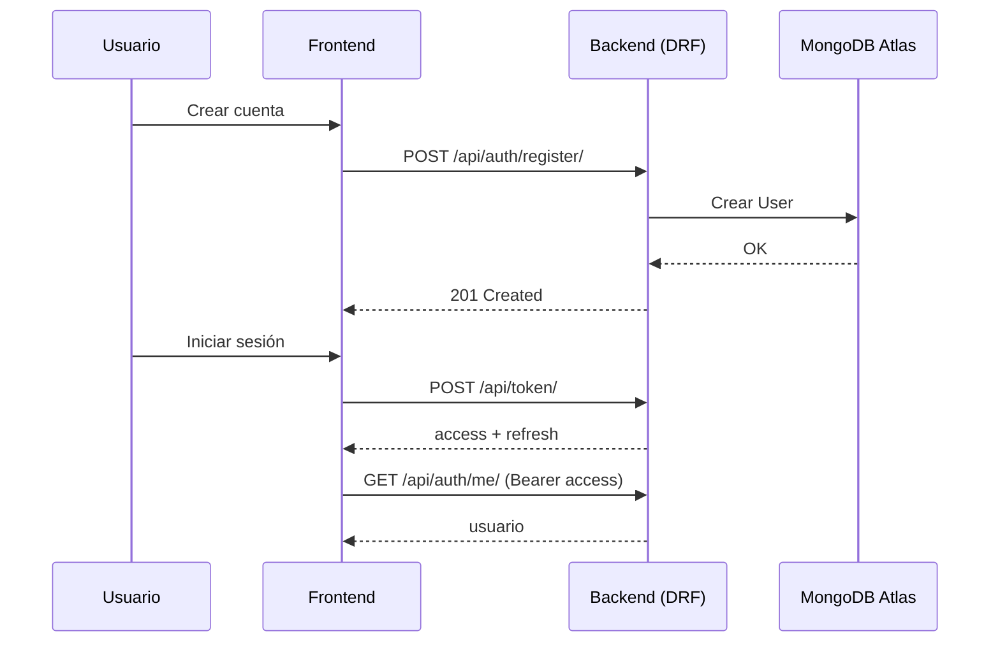
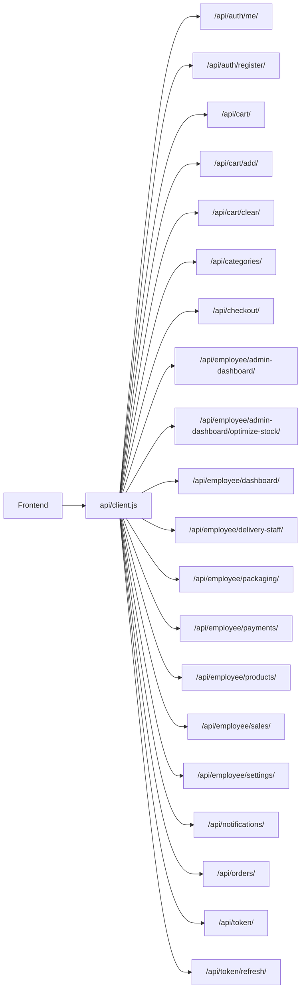

# Diagramas (Mermaid) - Palacio Gamer

Este archivo se genera automáticamente.

## ERD (MongoDB / Django Models)
```mermaid
erDiagram
  Category {
    string name
    string slug
    string subtitle
    text image_base64
    bool is_featured
    string layout_type
  }
  Product {
    string name
    string slug
    string brand
    string product_type
    FK Category category
    text description
    text specs
    decimal price
    decimal old_price
    int discount_percent
    int stock
    string status
    decimal rating
    int reviews_count
    text image_base64
    FileField image_file
    bool is_offer
    bool is_featured
  }
  Order {
    string order_code
    FK AUTH_USER_MODEL user
    ForeignKey payment
    ForeignKey product
    string product_name
    text product_description
    text product_image_base64
    int quantity
    decimal total
    string status
    string date_label
    text extra_info
    bool can_download_invoice
    bool can_track
    bool can_cancel
    FK AUTH_USER_MODEL assigned_to
    DateTimeField assigned_at
    FileField delivery_evidence_file
    DateTimeField delivered_at
    FK AUTH_USER_MODEL delivered_by
  }
  Payment {
    FK AUTH_USER_MODEL user
    string payment_code
    string method
    string status
    string sync_status
    decimal subtotal
    decimal shipping
    decimal igv
    decimal total
    string card_holder_name
    string card_last4
    string card_expiry
    string bank_name
    string bank_account
    string bank_cci
    FileField receipt_file
    FileField package_evidence_file
    DateTimeField created_at
  }
  Notification {
    FK AUTH_USER_MODEL user
    string title
    string message
    string type
    string time_label
    bool is_new
  }
  CartItem {
    FK AUTH_USER_MODEL user
    ForeignKey product
    string product_name
    text product_image_base64
    string product_image_url
    int quantity
    decimal price
  }
  LoginEvent {
    FK AUTH_USER_MODEL user
    bool is_employee
    DateTimeField created_at
  }
  CustomerProfile {
    OneToOneField user
    string address
    string phone
    text bio
  }
  SystemSetting {
    string key
    JSONField value
  }
  Category ||--o{ Product : category
  AUTH_USER_MODEL ||--o{ Order : user
  AUTH_USER_MODEL ||--o{ Order : assigned_to
  AUTH_USER_MODEL ||--o{ Order : delivered_by
  AUTH_USER_MODEL ||--o{ Payment : user
  AUTH_USER_MODEL ||--o{ Notification : user
  AUTH_USER_MODEL ||--o{ CartItem : user
  AUTH_USER_MODEL ||--o{ LoginEvent : user
```

## Arquitectura (Frontend → Backend → DB)
```mermaid
flowchart LR
  FE[Frontend (Vite/React)] -->|/api/* proxy| BE[Backend (Django/DRF)]
  BE --> DB[(MongoDB Atlas)]
  subgraph API[API Endpoints]
    api["/api/"]
    api_token["/api/token/"]
    api_token_refresh["/api/token/refresh/"]
    api_auth_me["/api/auth/me/"]
    api_auth_register["/api/auth/register/"]
    api_cart["/api/cart/"]
    api_cart_add["/api/cart/add/"]
    api_cart_clear["/api/cart/clear/"]
    api_cart_items__str_pk["/api/cart/items/<str:pk>/"]
    api_cart_items__str_pk__update["/api/cart/items/<str:pk>/update/"]
    api_categories["/api/categories/"]
    api_checkout["/api/checkout/"]
    api_employee_admin_dashboard["/api/employee/admin-dashboard/"]
    api_employee_admin_dashboard_optimize_stock["/api/employee/admin-dashboard/optimize-stock/"]
    api_employee_clients["/api/employee/clients/"]
    api_employee_clients__str_pk["/api/employee/clients/<str:pk>/"]
    api_employee_dashboard["/api/employee/dashboard/"]
    api_employee_deliveries["/api/employee/deliveries/"]
    api_employee_deliveries__str_pk["/api/employee/deliveries/<str:pk>/"]
    api_employee_delivery_staff["/api/employee/delivery-staff/"]
    api_employee_packaging["/api/employee/packaging/"]
    api_employee_packaging__str_payment_code__ship["/api/employee/packaging/<str:payment_code>/ship/"]
    api_employee_payments["/api/employee/payments/"]
    api_employee_payments__str_payment_code["/api/employee/payments/<str:payment_code>/"]
    api_employee_payments__str_payment_code__approve["/api/employee/payments/<str:payment_code>/approve/"]
    api_employee_payments__str_payment_code__reject["/api/employee/payments/<str:payment_code>/reject/"]
    api_employee_payments_export["/api/employee/payments/export/"]
    api_employee_products["/api/employee/products/"]
    api_employee_reports["/api/employee/reports/"]
    api_employee_sales["/api/employee/sales/"]
    api_employee_settings["/api/employee/settings/"]
    api_notifications["/api/notifications/"]
    api_orders["/api/orders/"]
    api_payments["/api/payments/"]
    api_payments__str_payment_code["/api/payments/<str:payment_code>/"]
    api_products["/api/products/"]
    api_products__slug_slug["/api/products/<slug:slug>/"]
  end
```

## Rutas (React Router)

```mermaid
flowchart TB
  R[Router] --> H[/ /]
  R --> hardware["/hardware"]
  R --> producto__slug["/producto/:slug"]
  R --> carrito["/carrito"]
  R --> checkout["/checkout"]
  R --> pago["/pago"]
  R --> pago_confirmacion__code["/pago/confirmacion/:code"]
  R --> mis_pedidos["/mis-pedidos"]
  R --> iniciar_sesion["/iniciar-sesion"]
  R --> login["/login"]
  R --> registro["/registro"]
  R --> login_empleado["/login-empleado"]
  R --> administradores["/administradores"]
  R --> empleado["/empleado"]
  R --> empleado["/empleado/*"]
  R --> dashboard["dashboard"]
  R --> productos["productos"]
  R --> productos_nuevo["productos/nuevo"]
  R --> ventas["ventas"]
  R --> clientes["clientes"]
  R --> entregas["entregas"]
  R --> empaquetado["empaquetado"]
  R --> pagos["pagos"]
  R --> reportes["reportes"]
  R --> configuracion["configuracion"]
  R --> route["*"]
  R --> route["*"]
```


## Auth (Registro + JWT + Me)


## Consumo de API (frontend/src/api/client.js)

